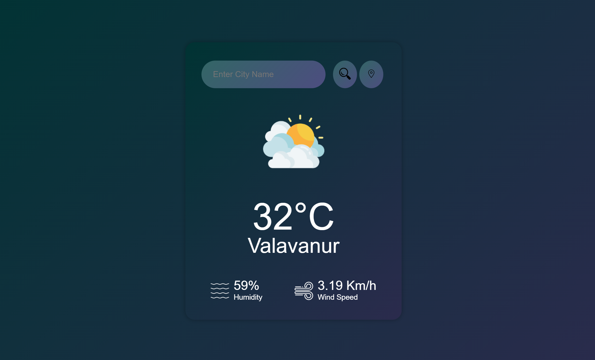

# PRODIGY_WD_05

## TASK 5 WEATHER APPLICATION

### Overview:
The Weather App is a web-based application that allows users to check the current weather conditions for a specified city. This project serves as a practical example of using HTML, CSS, JavaScript and OpenWeatherMap API to create a simple yet functional weather application.

### Key Features:

#### Search by City:
Users can enter the name of a city they want to check the weather for.

#### Display Weather Data:
The app retrieves weather data from the OpenWeatherMap API and displays key information, including temperature, humidity, wind speed, and a weather icon representing the current conditions.

#### Dynamic Icons: 
The app dynamically updates the weather icon based on the current weather conditions (e.g., cloudy, clear, rainy, etc.).

#### Error Handling: 
It provides error handling for invalid city names, displaying an error message when a city cannot be found.

#### Technology Stack:

- HTML: Used for structuring the web page.
- CSS: Used for styling and layout.
- JavaScript: Used for fetching data from the OpenWeatherMap API and updating the user interface dynamically.
- OpenWeatherMap API: Used to retrieve weather data based on the user's input.

#### Usage
Enter a city name in the input field and click the "Search" button to get weather data for that city.
Click the "Use Current Location" button to fetch weather data based on your current location.

